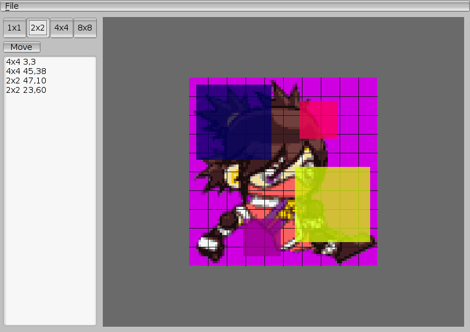

SNESMeta
========

SNES metasprite utility.

Given a PNG frame, properly paletted, this util lets you place SNES
sprites on top, building a metasprite. There are algorithms, but at
this kind of task humans tend to do better.

No checks for only using two sprite sizes, and the size info is not
currently output. So it's recommended to only use one size, or edit
the source to output the small/big info somehow.

Usage
-----

Arrow keys change the current tool.

To move a sprite, use the move tool, or select a sprite from the list.
To delete a sprite, click outside the image borders when moving.

When all non-background pixels are covered, the grey background turns green.
